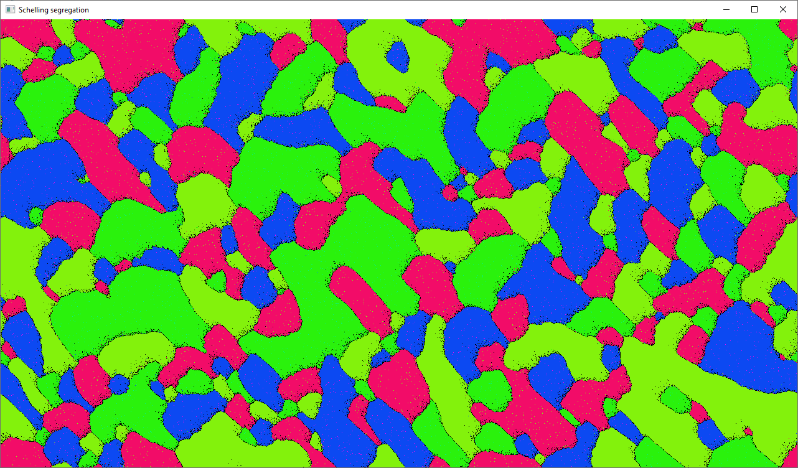

# SFML_Shelling

### Модель сегрегации Шеллинга на языке C++ с библиотекой SFML

## Установка

- Скачать скомпилированный .exe в релизах и запустить
  
## Использование

- При запуске открывается консоль, в которую выводится информация о ходе работы.
- Стрелки влево/вправо меняют *настраиваемый* параметр (вероятность пустой клетки, количество цветов, терпимость и радиус проверки)
- Стрелки вверх/вниз *увеличивают/уменьшают* настраиваемый параметр. Если менять очень часто (примерно больше раза в секунду), то программа вылетит (будет исправлено)

## Демонстрация

Пример сегрегации с четырьмя группами

Консоль с информацией

## Баги
  
- Плохой подбор цветов 

- Вылеты из-за ошибки с доступом к памяти

## В будущем

- Улучшенный контроль параметров модели

- Полноэкранный режим
