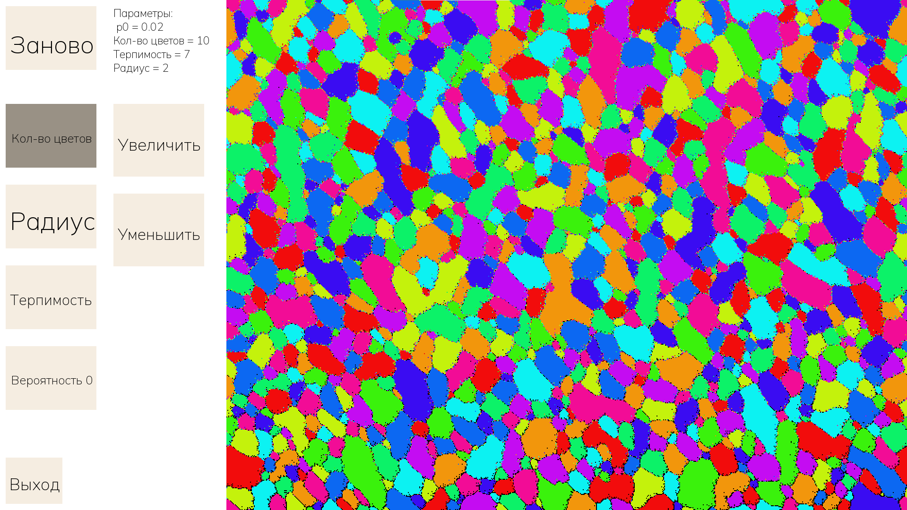

# SFML_Sсhelling

### Модель сегрегации Шеллинга на языке C++ с библиотекой SFML

## Установка

- Скачать скомпилированный .exe в релизах и запустить
  
## Использование

- В левой части экрана расположены кнопки для управления моделью
- Для выхода в левом нижнем углу есть кнопка "Выход"
- Кнопка "Заново" запускает симуляцию сначала с теми же начальными параметрами
- Текущие параметры выводятся рядом с кнопкой перезапуска
- Для изменения параметров выберите его нажатием соответствующей кнопки и увеличивайте/уменьшайте кнопками в правой части

## Что это?
    Модель сегрегации Шеллинга – это агент-ориентированная модель, которая иллюстрирует, как индивидуальные тенденции в отношении соседей могут привести к сегрегации.
Проще говоря, модель показывает, как группы сегрегируются (обособляются) в зависимости от соседей каждого представителя группы.

Создаётся поле, в котором случайным образом выставлены пиксели разных цветов и небольшой процент пустых (черных) пикселей. На шаге обработки для каждого пикселя считается количество пикселей другого цвета вокруг него. Если это значение больше порогового (терпимость), то он переезжает в случайную свободную клетку.

 Когда терпимость меньше примерно трети от числа рассматриваемых соседей, то довольно быстро появляются явные обособленные области, в которых находятся пиксели одного цвета (представители одной группы). 

 Программа позволяет эксперементировать с разным количеством групп-цветов, радиусом проверки соседей, терпимостью и количеством пустых клеток (вероятность 0).
## Демонстрация

Пример сегрегации с десятью группами

## Баги
  
- Известных багов на данный момент нет

## В будущем

- Возможность выбирать терпимость и размер (количество пикселей) для каждого цвета
